# Phase6 Fixed-Layout 单 Reward 实验反馈报告

日期：2026-06-09  
服务器结果目录：`/data/shengwz/swz/RL-seismic-inversion/runs/phase6_fixed_layout`  
本地同步目录：`reports/phase6_fixed_layout_feedback/`

## 1. 完成状态

`run_phase6_dense_grid.sh` 的 corrected fixed-layout 实验已经完整结束：

| 检查项 | 数量 |
|---|---:|
| Reward × CVA run 目录 | 80 / 80 |
| `metrics.csv` | 80 / 80 |
| `config.json` | 80 / 80 |
| `policy_final.pt` | 80 / 80 |
| `final_velocity.npy` | 80 / 80 |
| `models_residuals_curves.png` | 80 / 80 |
| `shot_wiggle_overlays.png` | 80 / 80 |
| `WARN / Traceback / ValueError / RuntimeError / FAILED` | 0 |

实验矩阵：

- Rewards: `l1l2`, `tt_only`, `wasserstein`, `wasserstein_w2`, `ncc_zero`, `ncc_maxlag`, `envelope_ncc`, `awi`
- CVA models: `1 2 5 6 8 10 15 16 18 50`
- Seed: `42`
- 设置：单 reward、单 seed、`G=32`、`ppo_epochs=4`、`lr=5e-3`、`steps=5000`、透射几何、canonical seismic layout `[shot, receiver, time]`

## 2. 总体排名

以下排名使用每个 run 的 `best_mae_global`，也就是训练过程中采样到的最佳 MAE。这个指标是 oracle-style 评估，适合比较 reward 是否能把搜索引向好模型。

| Rank | Reward | Mean Best MAE | Median | Std | Min | Max | Mean Final MAE | Final-Best Gap | Wins |
|---:|---|---:|---:|---:|---:|---:|---:|---:|---:|
| 1 | `wasserstein` | 61.90 | 49.43 | 42.30 | 4.53 | 146.31 | 95.34 | 33.44 | 2 |
| 2 | `wasserstein_w2` | 66.31 | 65.25 | 33.39 | 7.44 | 124.63 | 94.55 | 28.24 | 2 |
| 3 | `tt_only` | 71.41 | 70.41 | 40.77 | 10.15 | 150.02 | 105.07 | 33.66 | 2 |
| 4 | `awi` | 72.82 | 66.70 | 37.65 | 22.75 | 147.10 | 109.04 | 36.22 | 0 |
| 5 | `ncc_maxlag` | 73.24 | 67.26 | 36.98 | 21.27 | 147.39 | 117.80 | 44.56 | 0 |
| 6 | `envelope_ncc` | 74.42 | 68.95 | 37.71 | 22.58 | 146.66 | 109.12 | 34.70 | 0 |
| 7 | `ncc_zero` | 96.09 | 73.12 | 68.05 | 25.96 | 244.62 | 142.35 | 46.26 | 1 |
| 8 | `l1l2` | 108.89 | 64.32 | 94.25 | 13.34 | 268.66 | 148.11 | 39.21 | 3 |

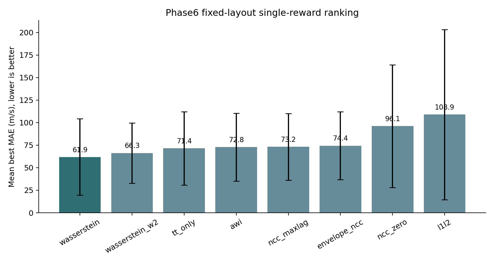

## 3. Heatmap：不同模型上的 reward 差异

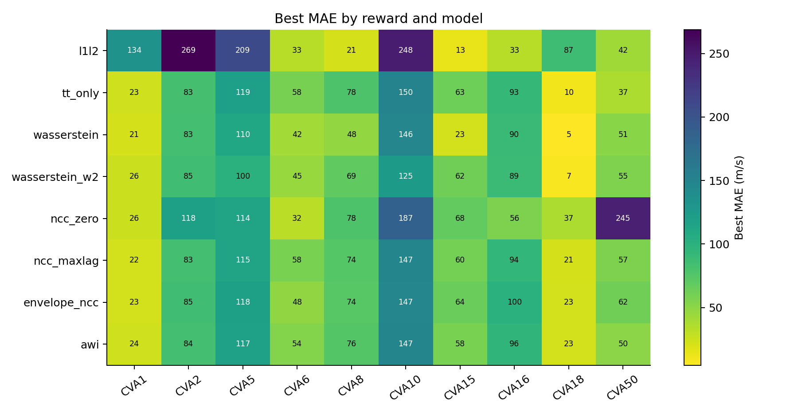

逐模型最优 reward：

| CVA | Best Reward | Best MAE | Final MAE | Runner-up | Runner-up MAE |
|---:|---|---:|---:|---|---:|
| 1 | `wasserstein` | 21.44 | 41.19 | `ncc_maxlag` | 22.48 |
| 2 | `tt_only` | 82.74 | 108.41 | `wasserstein` | 83.22 |
| 5 | `wasserstein_w2` | 100.31 | 152.11 | `wasserstein` | 110.41 |
| 6 | `ncc_zero` | 31.58 | 32.36 | `l1l2` | 32.77 |
| 8 | `l1l2` | 21.27 | 23.84 | `wasserstein` | 47.61 |
| 10 | `wasserstein_w2` | 124.63 | 159.86 | `wasserstein` | 146.31 |
| 15 | `l1l2` | 13.34 | 14.37 | `wasserstein` | 22.81 |
| 16 | `l1l2` | 33.23 | 33.85 | `ncc_zero` | 56.35 |
| 18 | `wasserstein` | 4.53 | 6.43 | `wasserstein_w2` | 7.44 |
| 50 | `tt_only` | 36.86 | 57.26 | `l1l2` | 42.03 |

## 4. Best 与 Final 的差距

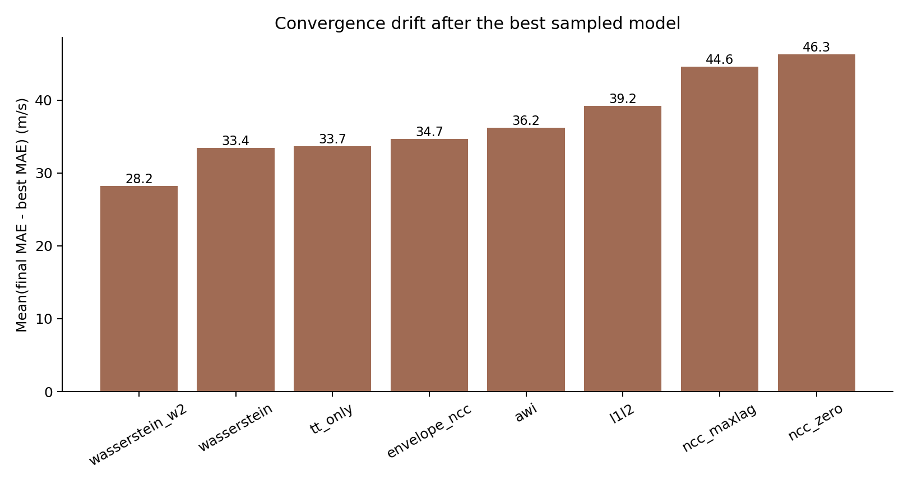

这批实验里，一个很重要的现象是：`best MAE` 和最后收敛时的 `final MAE` 差距仍然不小。

- `wasserstein_w2` 的 mean final-best gap 最小：28.24 m/s。
- `wasserstein` 和 `tt_only` 的 gap 约 33 m/s。
- `ncc_maxlag` 和 `ncc_zero` 的 gap 偏大，分别约 44.56 和 46.26 m/s。

所以这次不能只说 “某 reward 找到了好模型”，还要说它能否把 policy 最后稳定在好区域。当前看，Wasserstein 系列在这两点上都相对更好。

## 5. 代表性收敛曲线

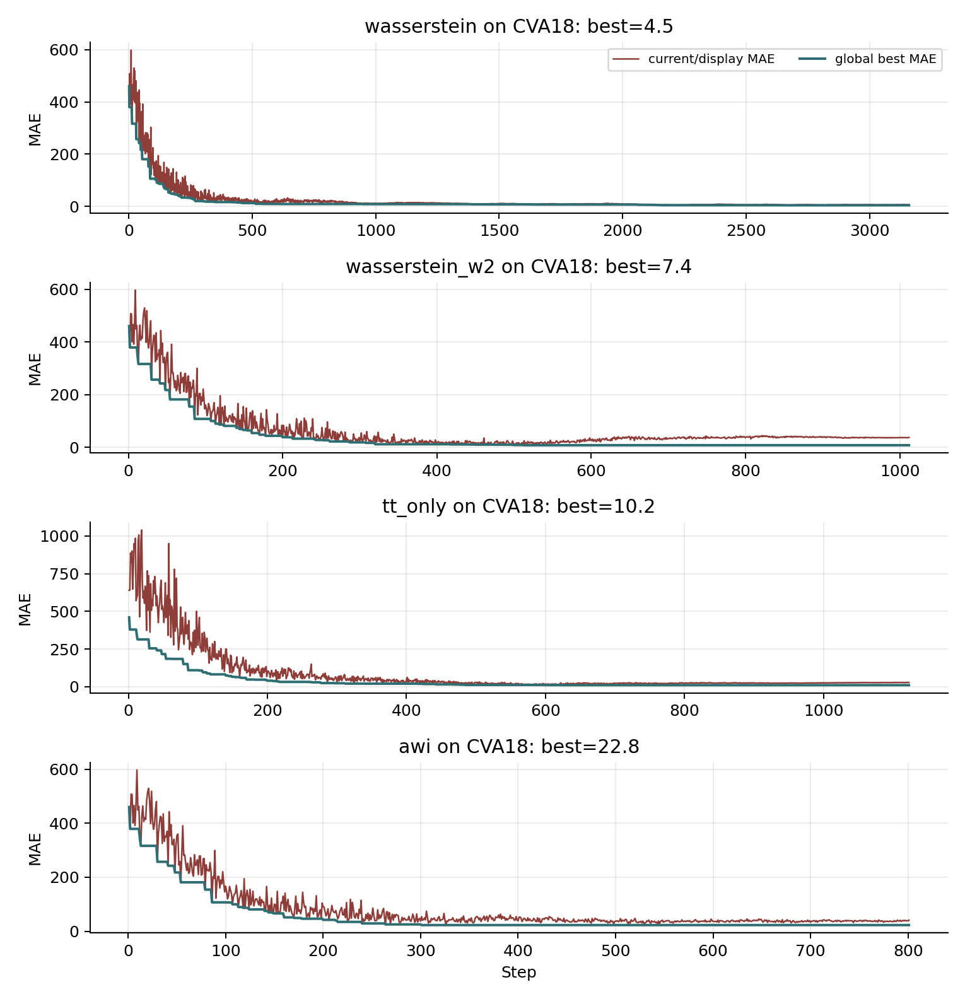

这些曲线说明：Phase6 fixed-layout 后，reward 不是完全失效；多个 reward 都能在早期或中期把 best MAE 拉低。但最终曲线常常出现回摆，说明 PPO policy 的稳定收敛仍然是问题。

## 6. 可视化样例

### 6.1 Wasserstein on CVA18：全局最佳之一

`wasserstein` 在 CVA18 上达到 best MAE = 4.53，final MAE = 6.43，是这批里非常干净的成功样例。

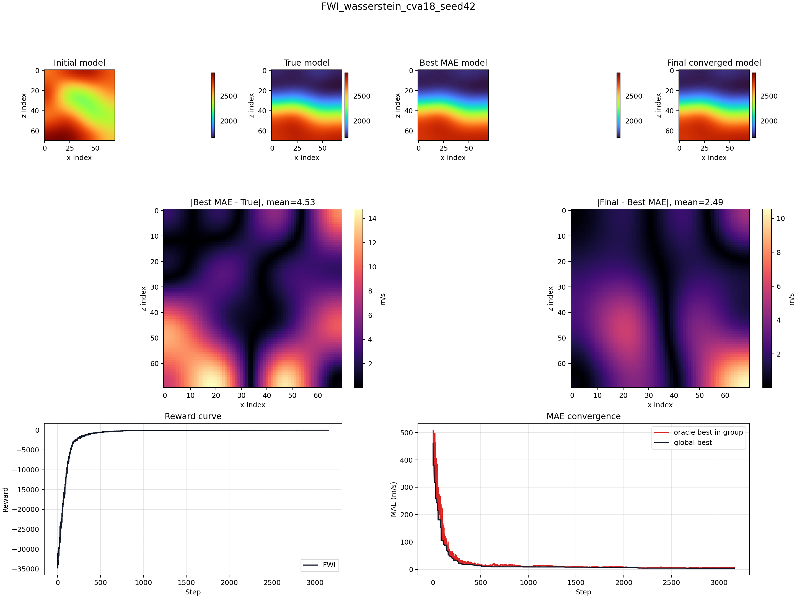

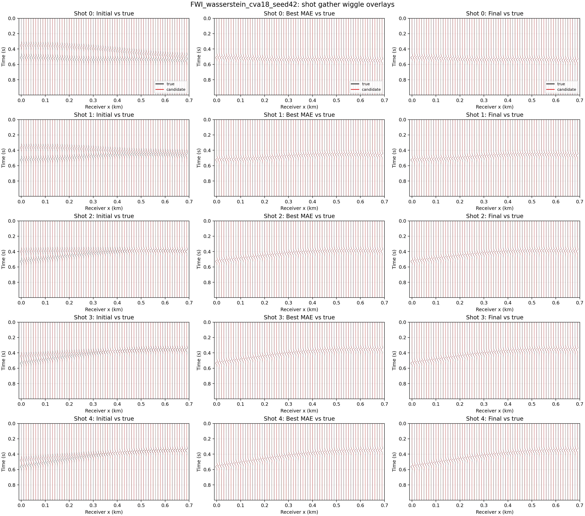

### 6.2 Wasserstein W2 on CVA10：困难模型上的最佳

`wasserstein_w2` 在 CVA10 上是该模型最优，best MAE = 124.63，明显优于 `wasserstein` 的 146.31。

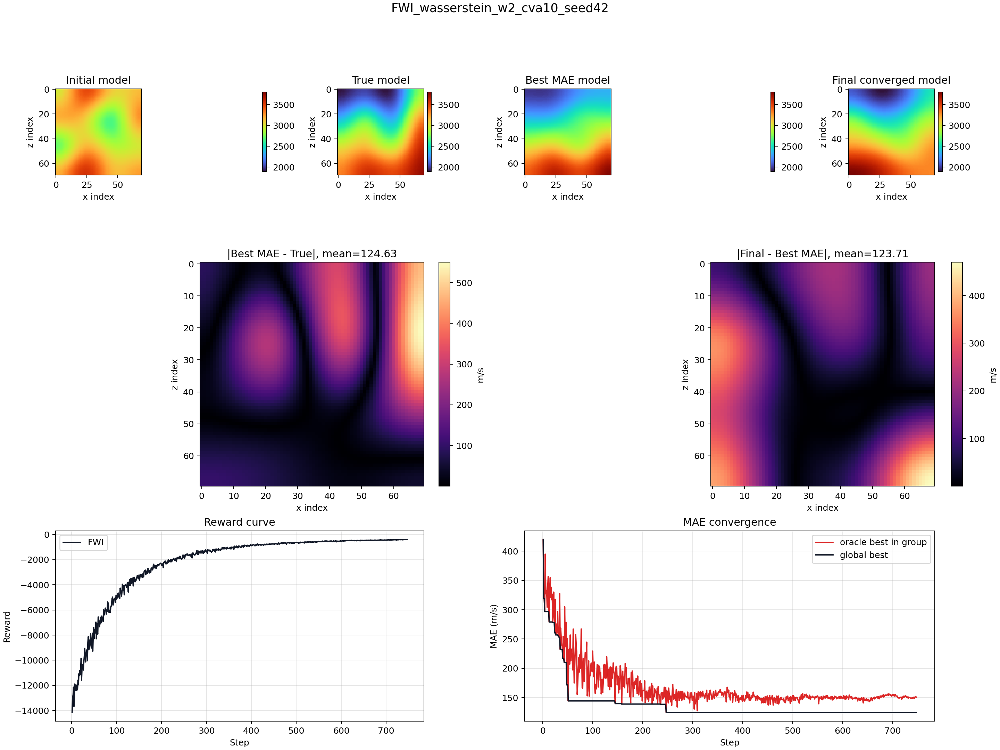

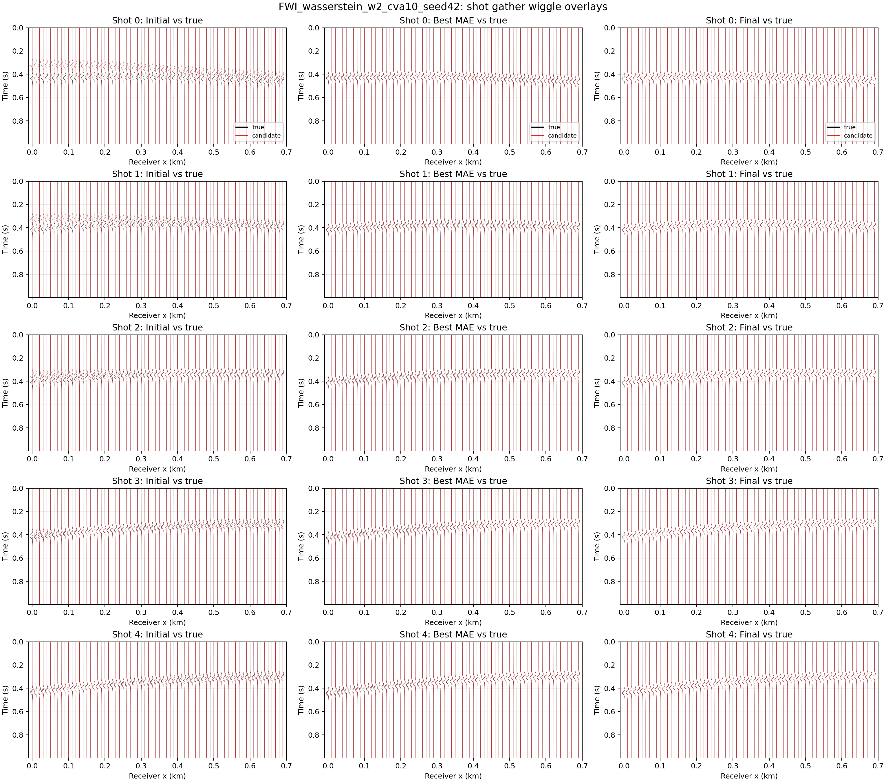

### 6.3 TT-only on CVA50：走时 reward 仍然稳

`tt_only` 在 CVA50 上 best MAE = 36.86，是该模型最优。这个结果说明修复 layout 后，TT reward 重新有了有效的时间轴物理含义。

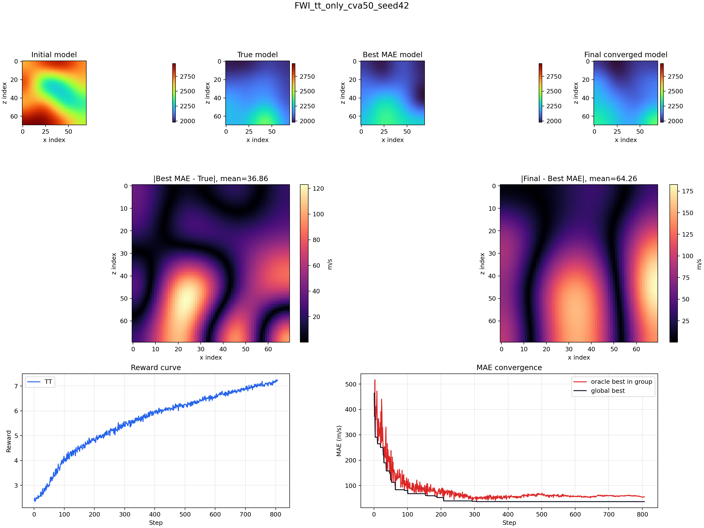

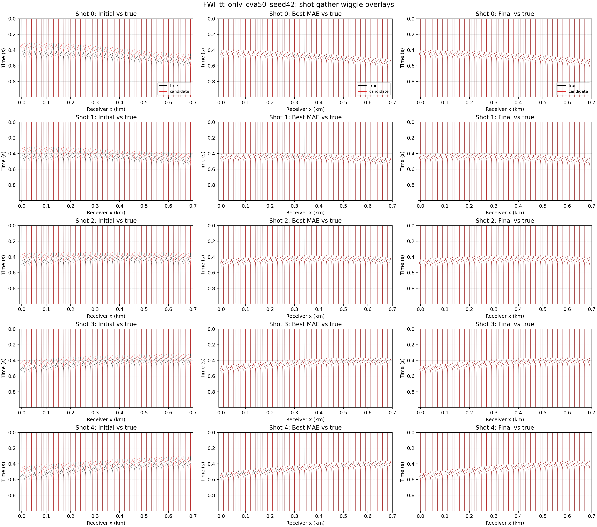

### 6.4 L1+L2 on CVA15：传统 misfit 在简单模型上仍可很强

`l1l2` 的均值排名最后，但它在 CVA15、CVA16、CVA8 上赢了。这说明传统 waveform misfit 并非完全不可用，而是模型依赖性强，遇到困难模型时容易崩。

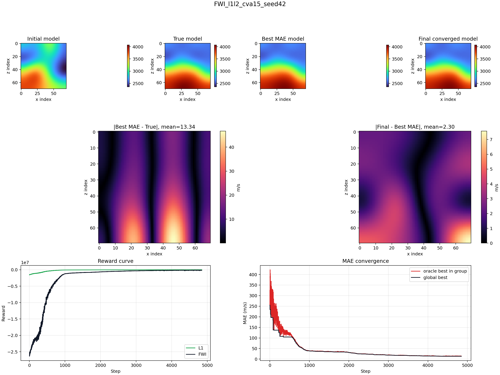

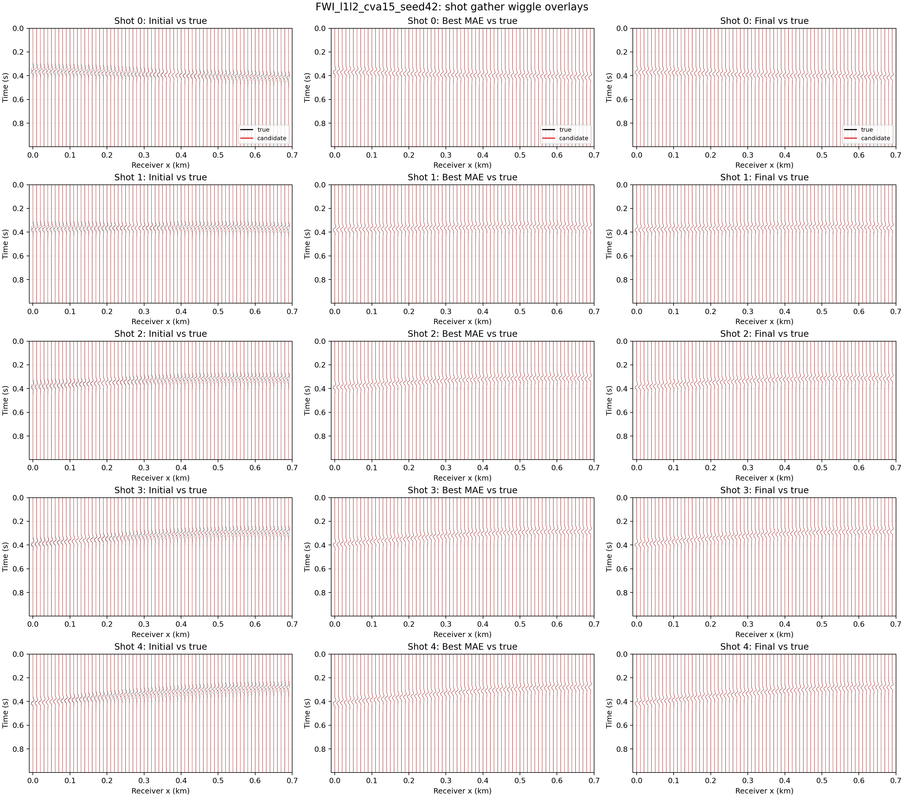

## 7. 对 NCC / Cross Correlation 的判断

导师预期 Cross Correlation 应该是稳定有效的基本 reward。Phase6 fixed-layout 后，结论需要更细：

1. `ncc_maxlag` 没有崩，mean best MAE = 73.24，和 `awi`、`envelope_ncc` 很接近。
2. 但它没有在 10 个模型中拿到单模型第一，平均也落后 `wasserstein`、`wasserstein_w2`、`tt_only`。
3. `ncc_zero` 平均更差，mean best MAE = 96.09，但在 CVA6 上拿到第一。
4. 这说明 zero-lag NCC 作为单 reward 不够稳；max-lag NCC 更合理，但全 trace 单一 lag 仍可能太粗。

我的判断是：Cross Correlation 的理论方向没有错，但当前实现还不是导师文献里最理想的 “windowed time-lag / localized correlation” 形式。下一步如果继续做 NCC，优先级应该是：

- 固定窗口或事件窗口的 `windowed_ncc_maxlag`
- 用 correlation peak 作为 confidence 权重
- 对低置信窗口降权
- 统计 lag 是否随训练向 0 收敛

## 8. 这批实验支持什么结论

### 比较稳的结论

- layout 修复后，trace-wise reward 可以正常跑完，没有再出现 TT 全 0 或 receiver/time 轴混淆导致的异常。
- Wasserstein 系列仍然是最稳的单 reward 候选。
- `tt_only` 恢复了有效性，并且在 CVA2/CVA50 上最好。
- `l1l2` 均值差，但在部分简单模型上很强，说明不能简单把 waveform misfit 全盘否定。
- `best` 与 `final` 差距仍然明显，policy 稳定收敛问题尚未解决。

### 需要谨慎的结论

- 这批只跑了 single reward + single seed，不能替代 Phase5 的 multi-seed / curriculum 结论。
- Phase5 的 curriculum 排名需要 fixed-layout 后重新复核。
- `ncc_maxlag` 的表现说明 cross-correlation 有用，但目前还不能说它是最稳定最强的基础 reward。

## 9. 建议下一步

1. 用 fixed-layout 复跑 Phase5 的 top curriculum：
   - `wasserstein → contrastive`
   - `wasserstein → l1l2`
   - `tt_only → contrastive`
   - `ncc_maxlag → contrastive`
2. 为 NCC 做 windowed time-lag 版本，而不是继续只依赖全 trace NCC。
3. 每个实验同时报告：
   - best MAE
   - final MAE
   - final-best gap
   - reward curve 与 MAE curve
   - wiggle overlay
4. 如果要和导师讨论 “Cross Correlation 为什么没最强”，建议重点解释：当前 NCC 是全 trace 级单 reward，尚未实现文献里更稳的窗口化、置信加权、局部事件匹配。

## 10. 文件索引

汇总表：

- [phase6_run_summary.csv](phase6_run_summary.csv)
- [phase6_reward_summary.csv](phase6_reward_summary.csv)
- [phase6_model_best.csv](phase6_model_best.csv)

总览图：

- [reward_mean_best_mae.png](summary_figures/reward_mean_best_mae.png)
- [reward_model_best_mae_heatmap.png](summary_figures/reward_model_best_mae_heatmap.png)
- [reward_final_minus_best_gap.png](summary_figures/reward_final_minus_best_gap.png)
- [selected_convergence_curves.png](summary_figures/selected_convergence_curves.png)

完整可视化索引：

- [phase6_visual_index.md](phase6_visual_index.md)

